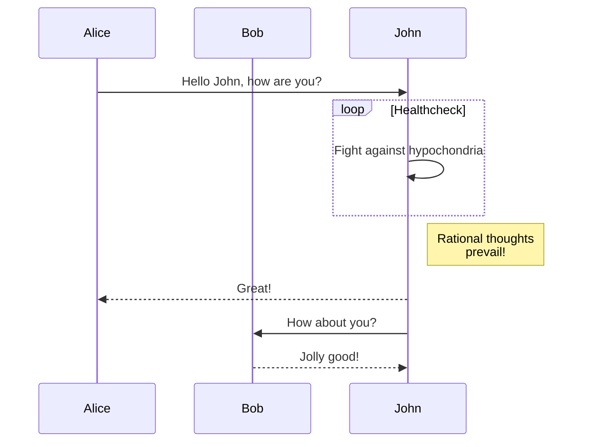
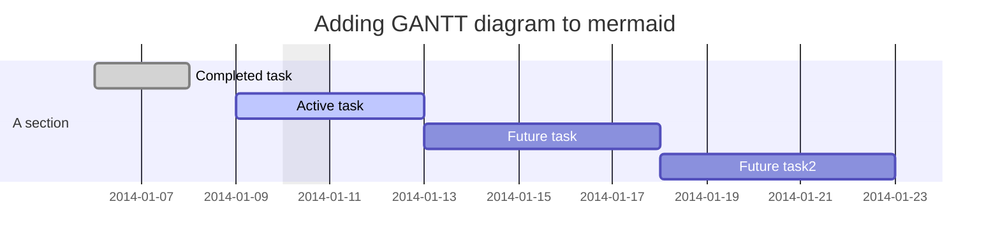
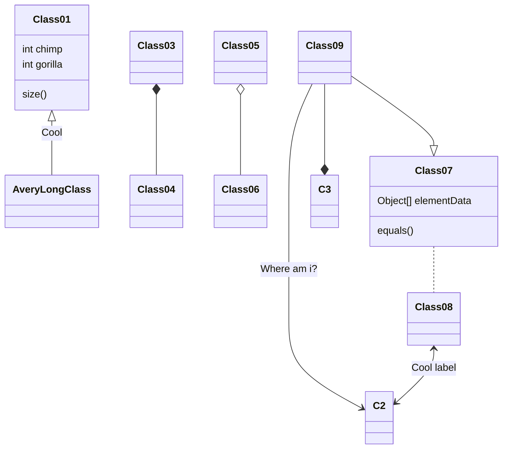
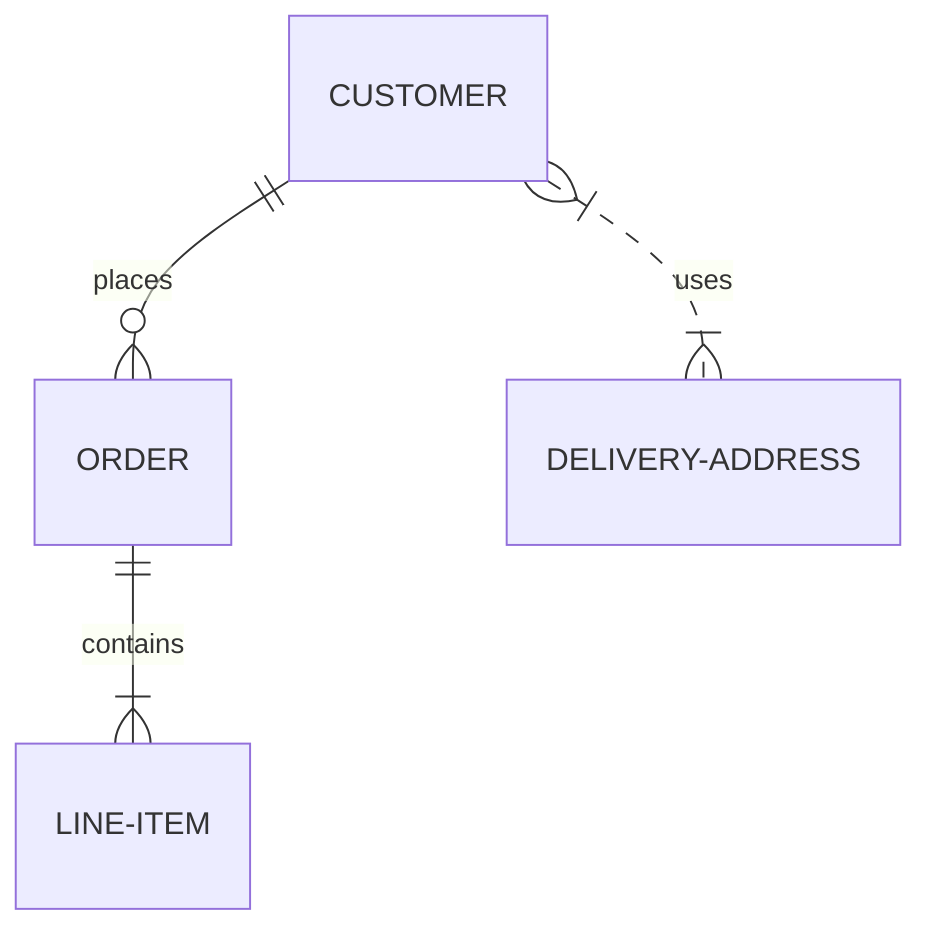
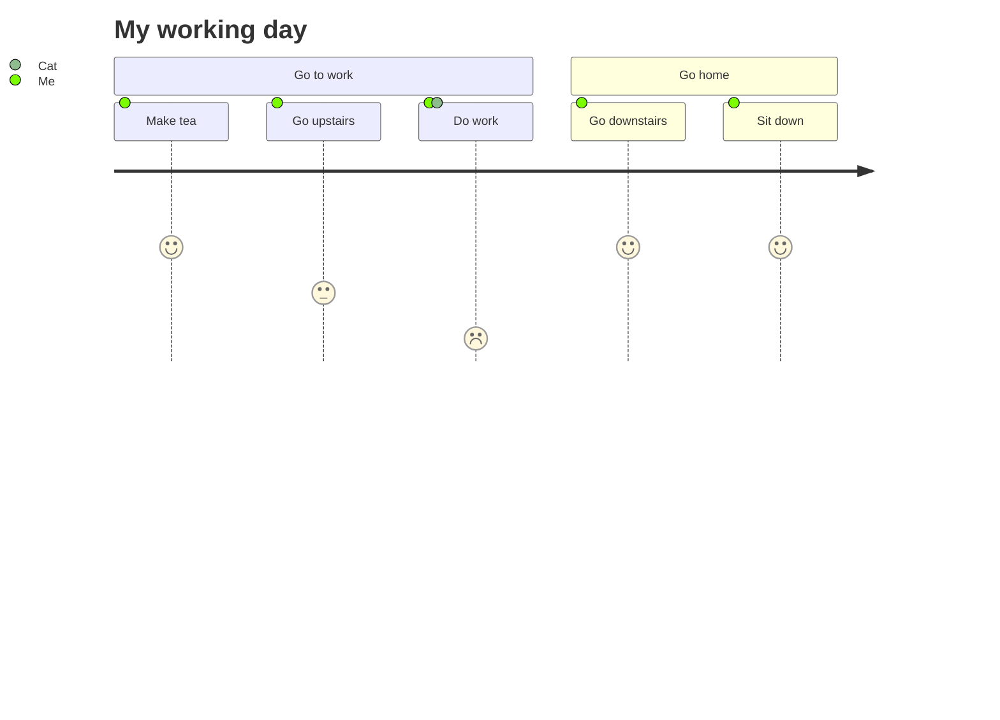
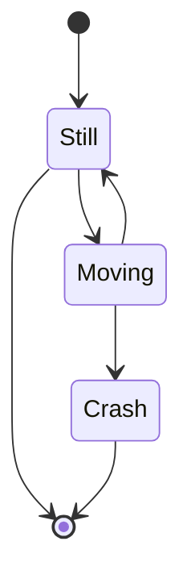
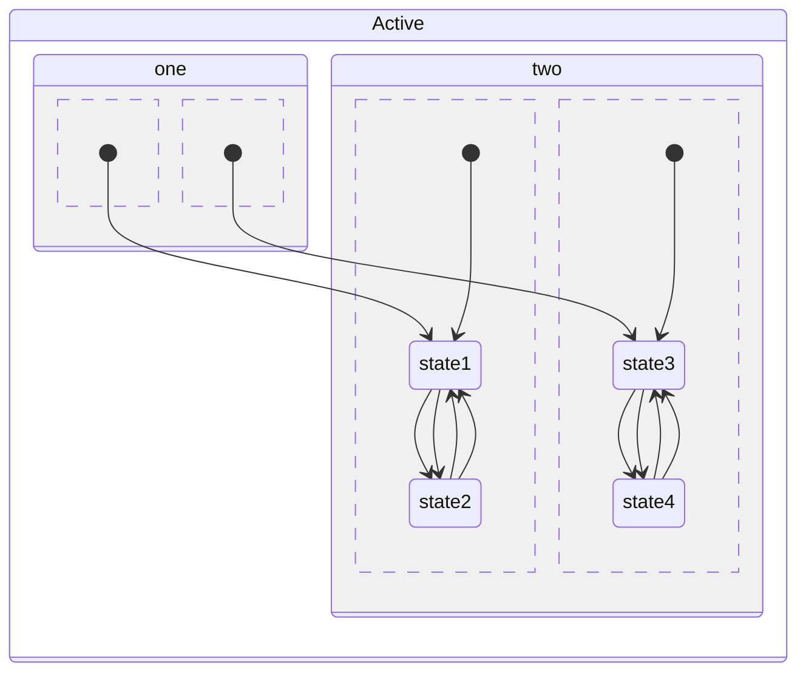
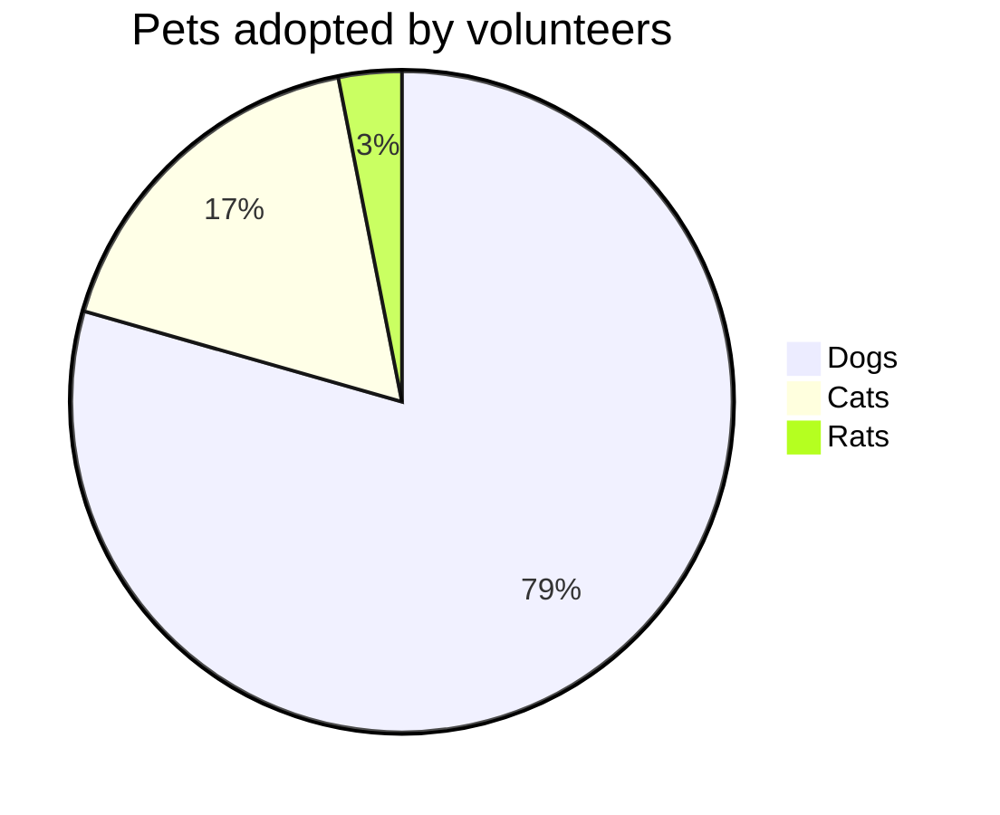

## Java Code

```java {3}
public class Main {
  public static void main(String[] args) {
    System.out.println("Hello, VuePress Theme Reco!")
  }
}
```

## JavaScript Code

```js {2}
;(function () {
  console.log('Hello, VuePress Theme Reco!')
})()
```

## TypeScript Code

```ts {1}
const hello: string = 'Hello, VuePress Theme Reco!'
console.log(hello)
```

## Golang Code

```go {4}
import "fmt"

func main() {
    fmt.Println("Hello, VuePress Theme Reco!")
}

```

## CodePen

<iframe height="400" style="width: 100%;" scrolling="no" title="【CSS：行为】使用:hover和attr()定制悬浮提示" src="https://codepen.io/xugaoyi/embed/vYNKNaq?height=400&theme-id=light&default-tab=css,result" frameborder="no" allowtransparency="true" allowfullscreen="true" loading="lazy">
  See the Pen <a href='https://codepen.io/xugaoyi/pen/vYNKNaq'>【CSS：行为】使用:hover和attr()定制悬浮提示</a> by xugaoyi
  (<a href='https://codepen.io/xugaoyi'>@xugaoyi</a>) on <a href='https://codepen.io'>CodePen</a>.
</iframe>

## Mermaid

### 流程图


### 时序图



### 甘特图



### 类图



### E-R 图



### 用户旅程图



### Git

<!-- ```mermaid
gitGraph
    commit
    commit
    branch develop
    commit
    commit
    commit
    checkout main
    commit
    commit
``` -->

### 状态图





### 饼图


