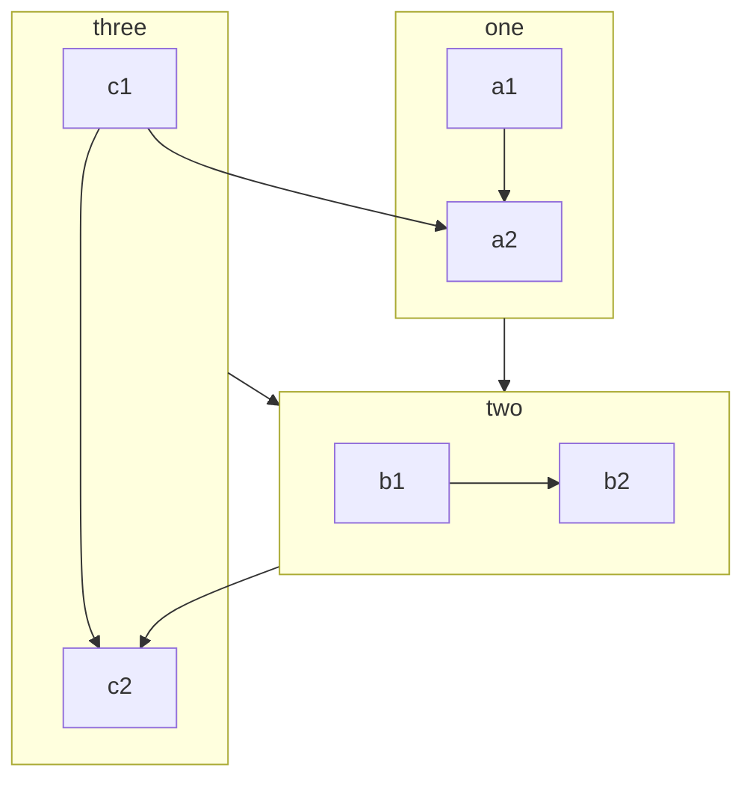
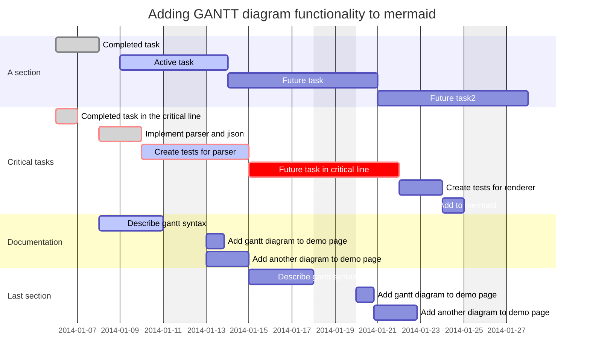
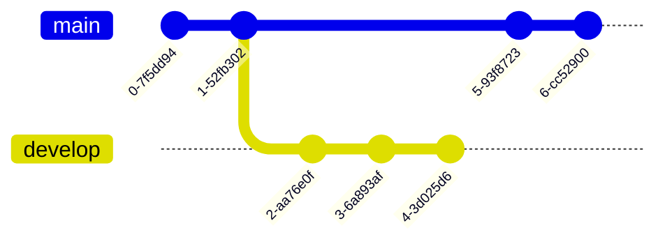

## Java Code

```java {3}
public class Main {
  public static void main(String[] args) {
    System.out.println("Hello, VuePress Theme Reco!")
  }
}
```

## JavaScript Code

```js {2}
;(function () {
  console.log('Hello, VuePress Theme Reco!')
})()
```

## TypeScript Code

```ts {1}
const hello: string = 'Hello, VuePress Theme Reco!'
console.log(hello)
```

## Golang Code

```go {4}
import "fmt"

func main() {
    fmt.Println("Hello, VuePress Theme Reco!")
}

```

## Mermaid

### 流程图



### 时序图

```sequence
Alice ->> Bob: Hello Bob, how are you?
Bob-->>John: How about you John?
Bob--x Alice: I am good thanks!
Bob-x John: I am good thanks!
Note right of John: Bob thinks a long<br/>long time, so long<br/>that the text does<br/>not fit on a row.

Bob-->Alice: Checking with John...
Alice->John: Yes... John, how are you?
```

### 甘特图



### 类图

```class
Class01 <|-- AveryLongClass : Cool
Class03 *-- Class04
Class05 o-- Class06
Class07 .. Class08
Class09 --> C2 : Where am i?
Class09 --* C3
Class09 --|> Class07
Class07 : equals()
Class07 : Object[] elementData
Class01 : size()
Class01 : int chimp
Class01 : int gorilla
Class08 <--> C2: Cool label
```

### E-R 图

```er
CAR ||--o{ NAMED-DRIVER : allows
CAR {
    string registrationNumber
    string make
    string model
}
PERSON ||--o{ NAMED-DRIVER : is
PERSON {
    string firstName
    string lastName
    int age
}
```

### 用户旅程图

```journey
title My working day2
section Go to work
  Make tea: 5: Me
  Go upstairs: 3: Me
  Do work: 1: Me, Cat
section Go home
  Go downstairs: 5: Me
  Sit down: 5: Me
```

### Git



### 状态图

```state
[*] --> Active

state Active {
    [*] --> NumLockOff
    NumLockOff --> NumLockOn : EvNumLockPressed
    NumLockOn --> NumLockOff : EvNumLockPressed
    --
    [*] --> CapsLockOff
    CapsLockOff --> CapsLockOn : EvCapsLockPressed
    CapsLockOn --> CapsLockOff : EvCapsLockPressed
    --
    [*] --> ScrollLockOff
    ScrollLockOff --> ScrollLockOn : EvScrollLockPressed
    ScrollLockOn --> ScrollLockOff : EvScrollLockPressed
}
```

### 饼图

```pie
title What Voldemort doesn’t have?
  "FRIENDS" : 2
  "FAMILY" : 3
  "NOSE" : 45
```
